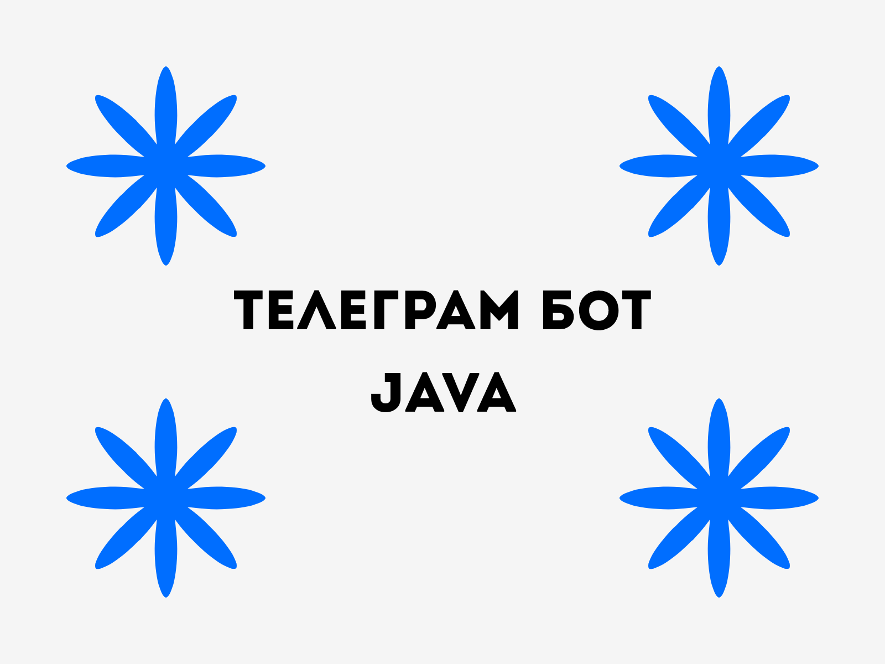

Это телеграм-бот на **Java**, который повторяет текстовые сообщения.

## Запуск
**1. Чтобы использовать бота, нужно выполнить следующую команду**
~~~bash
cp .env.example .env
~~~

**2. После того как файл для секретов был создан, нужно его заполнить. Ниже расписано что куда**

- `BOT_USERNAME` – Юзернейм бота
- `BOT_TOKEN` – Токен бота из @BotFather

**3. Запуск бота**  
_Теперь нужно перейти в корень проекта (там где лежат src/ и build.gradle), и написать следующее_
~~~bash
gradle run
~~~